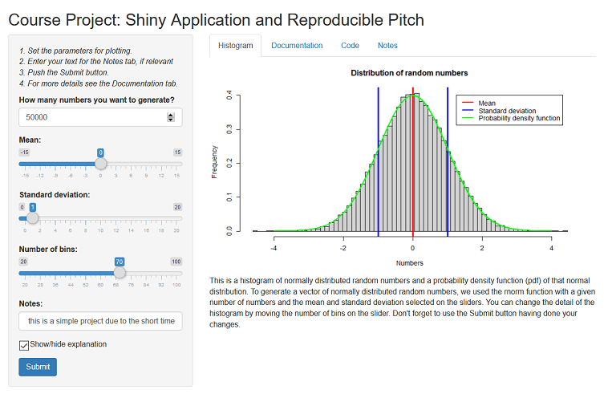

## Overview

My app plots a normal distribution for a given number of random numbers with a specified mean and standard deviation.


My application link  
https://nravinskaya.shinyapps.io/devdatprodapp/


My server.R and ui.R code on github  

## Application Screenshot



## Code Example

This is a **schematic** piece of code for plotting a histogram and pdf curve for the given input parameters.

```{r shortcode1, eval=FALSE, message=FALSE}
n = 50000; mean = 0; sd = 1; bin = 70
x <- rnorm(n, mean, sd)
range2x <- seq(-4, 4, length = n)*sd + mean 
c <- dnorm(range2x, mean, sd)
bins <- seq(min(x), max(x), length = bin + 1)
hist(x, breaks = bins, prob=TRUE, 
     main = "Distribution of random numbers",
     xlab = "Numbers", ylab = "Frequency")
lines(range2x, c, type = "l", col = "green", lwd = 2)
```

***

...displaying the result of code execution...

```{r shortcode2, echo=FALSE, message=FALSE}
n = 50000; mean = 0; sd = 1; bin = 70
x <- rnorm(n, mean, sd)
range2x <- seq(-4, 4, length = n)*sd + mean 
c <- dnorm(range2x, mean, sd)
bins <- seq(min(x), max(x), length = bin + 1)
hist(x, breaks = bins, prob=TRUE, 
     main = "Distribution of random numbers",
     xlab = "Numbers", ylab = "Frequency")
lines(range2x, c, type = "l", col = "green", lwd = 2)
```
